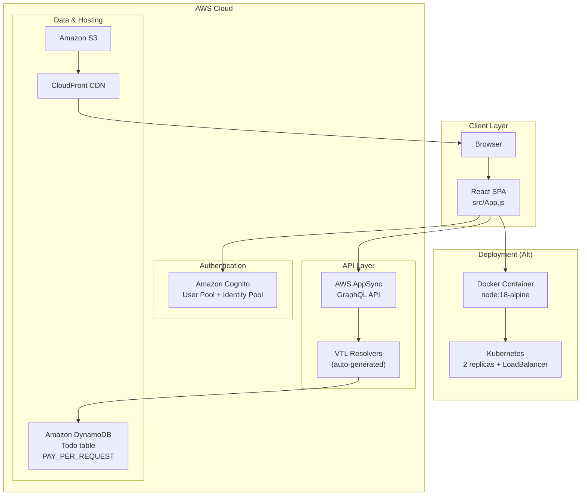

# Todo App — Serverless Web Application

A serverless todo application built with React and AWS Amplify. Users can create, update, delete, and fetch tasks with authentication.

## System Architecture



### Data Flow

1. **Authentication** — User signs in via email/password through Cognito; the Amplify `<Authenticator>` component handles the UI and token management.
2. **API Requests** — Authenticated user triggers CRUD operations via `generateClient().graphql()` calls to AppSync.
3. **Authorization** — AppSync validates the Cognito JWT and enforces owner-based access (`@auth` rule).
4. **Data** — AppSync resolvers read/write to the DynamoDB `Todo` table.
5. **Hosting** — Static assets are served via S3 + CloudFront.

## Tech Stack

| Layer | Technology |
|---|---|
| Frontend | React 18, JavaScript |
| API | AWS AppSync, GraphQL |
| Auth | Amazon Cognito (email/password) |
| Database | Amazon DynamoDB (PAY_PER_REQUEST) |
| Hosting | S3 + CloudFront |
| Containerization | Docker (node:18-alpine) |
| Orchestration | Kubernetes (2 replicas) |

## Getting Started

This project was bootstrapped with [Create React App](https://github.com/facebook/create-react-app).

### Prerequisites

- Node.js 18+
- AWS account with Amplify CLI configured

### Install & Run

```bash
npm install
npm start
```

Open [http://localhost:3000](http://localhost:3000).

### Available Scripts

| Script | Description |
|---|---|
| `npm start` | Run development server |
| `npm test` | Launch test runner (watch mode) |
| `npm run build` | Build for production |

## Docker Setup

```bash
# Build image
docker build -t todo-app:v1 .

# Run container
docker run -d -p 5000:5000 todo-app:v1
```

## Deploy to Kubernetes

```bash
# Apply deployment and service
kubectl apply -f deployment.yaml

# Verify
kubectl get pods
kubectl get services
```

## AWS Amplify Backend

The backend is defined in `amplify/` and provisioned via CloudFormation stacks:

- **GraphQL API** — Single `Todo` model with `@model` and `@auth(rules: [{ allow: owner }])` directives.
- **Authentication** — Cognito User Pool with email-based sign-in, 8-char minimum password, 30-day refresh token.
- **Database** — DynamoDB table with on-demand billing.
- **Hosting** — S3 bucket fronted by CloudFront distribution.

## Future Improvements

- [ ] **UI Enhancements** — Replace console-logged results with a proper task list UI, inline editing, and completion toggles.
- [ ] **Real-time Updates** — Subscribe to AppSync mutations via `graphql/subscriptions.js` for live sync across clients.
- [ ] **Pagination & Search** — Implement `nextToken`-based pagination and filtering on `listTodos`.
- [ ] **Offline Support** — Enable DataStore mode for offline-first functionality with automatic conflict resolution.
- [ ] **CI/CD Pipeline** — Add GitHub Actions or Amplify deployments for automated build, test, and deploy.
- [ ] **Unit & E2E Tests** — Expand test coverage beyond the boilerplate `App.test.js`.
- [ ] **Container Port Alignment** — Fix the mismatch between `react-scripts` (port 3000) and the Docker/K8s config (port 5000) by adding a `PORT=5000` env variable.
- [ ] **Custom Domain & SSL** — Attach a custom domain via Route 53 and ACM for the CloudFront distribution.
- [ ] **Multi-Environment** — Set up separate dev, staging, and prod Amplify environments.
- [ ] **Monitoring & Logging** — Enable CloudWatch logging for AppSync and X-Ray tracing for end-to-end observability.
