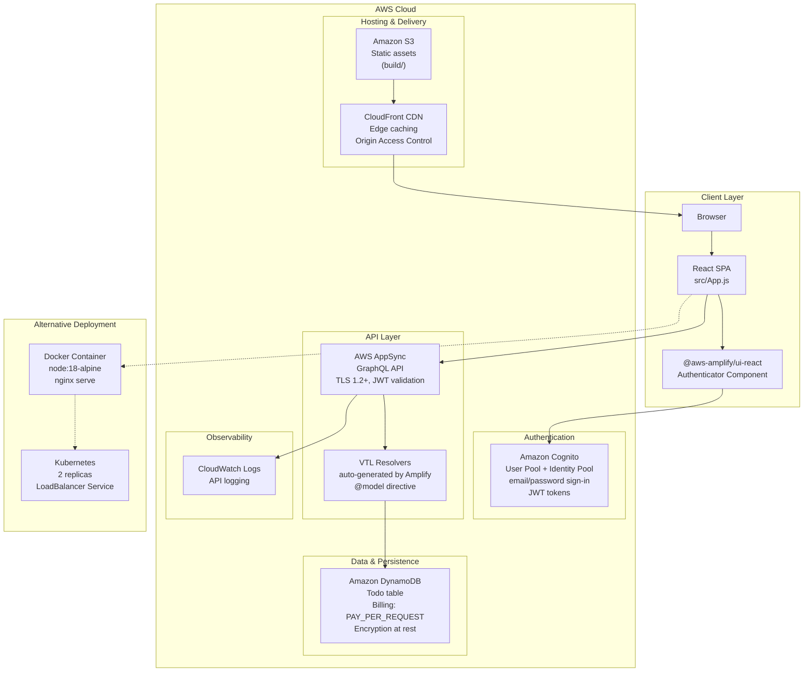

# Todo App — Serverless Web Application

A production-ready serverless todo application demonstrating how to build a full-stack web app with **React**, **AWS AppSync** (GraphQL), **Cognito** authentication, and **DynamoDB** — all deployed via **S3 + CloudFront**.

## Problem It Solves

Building a secure, scalable web application from scratch requires stitching together authentication, a managed API, a database, and hosting — each with their own configuration, security, and scaling concerns. This project provides a **reference implementation** of a serverless CRUD app that solves:

- **Who can access the app?** — Email/password authentication via Cognito, with token management handled by the Amplify client library.
- **Who can modify data?** — Owner-based authorization ensures users can only read/write their own todos (enforced at the GraphQL layer via `@auth` directive).
- **How does it scale?** — DynamoDB on-demand billing + AppSync managed GraphQL = zero provisioning, auto-scaling from zero to production load.
- **Where is it hosted?** — S3 static hosting behind CloudFront for low-latency global delivery with no server management.

## System Architecture



### Data Flow

1. **Authentication** — User signs in via email/password through Cognito; the Amplify `<Authenticator>` component handles the full UI flow and token lifecycle (refresh at 30 days).
2. **API Requests** — Authenticated user triggers CRUD operations via `generateClient().graphql()` calls to AppSync. The JWT access token is automatically attached to each request.
3. **Authorization** — AppSync validates the Cognito JWT and enforces owner-based access — every Todo item is scoped to its creator (`@auth(rules: [{ allow: owner }])`).
4. **Data** — AppSync VTL resolvers (auto-generated by Amplify's `@model` directive) read/write to the DynamoDB `Todo` table. Each item includes `owner` and `createdAt`/`updatedAt` timestamps.
5. **Hosting** — Static assets (`npm run build`) are uploaded to S3 and served via CloudFront with Origin Access Control (no public S3 access).

## Design Considerations

| Decision | Rationale |
|---|---|
| **AppSync over REST** | GraphQL provides precise data fetching (no over-fetching), auto-generated subscriptions for real-time updates, and strong typing via schema. |
| **DynamoDB over RDS** | Serverless, single-digit-millisecond latency at any scale, PAY_PER_REQUEST billing = pay only for what you use. Ideal for an app with unpredictable traffic. |
| **Owner-based auth** | Simplest security model for a multi-tenant todo app. Each user sees only their own data, enforced server-side — no client-side filtering needed. |
| **Cognito over custom auth** | Managed user pool with built-in UI, MFA support, password policies, and JWT token management. Eliminates the need to store or rotate credentials. |
| **VTL resolvers (Amplify-generated)** | Trade-off: fast setup vs. limited customisation. Sufficient for CRUD; for complex business logic, switch to Lambda resolvers or AppSync JavaScript resolvers. |
| **S3 + CloudFront** | S3 is the cheapest static hosting option; CloudFront adds global edge caching, HTTPS termination, and OAC (prevents direct S3 access). |
| **PAY_PER_REQUEST billing** | Avoids capacity planning. Table scales automatically; only concern is hot partitions — mitigated by `@model`'s auto-generated `id` (ULID) as partition key. |
| **Docker + K8s (alternative)** | Included for teams that need containerised deployments. Note the port mismatch (3000 vs 5000) — resolved by setting `PORT=5000` env var. |

## Tech Stack

| Layer | Technology | Purpose |
|---|---|---|
| Frontend | React 18, JavaScript, Amplify UI React | SPA with auth UI components |
| API | AWS AppSync, GraphQL | Managed GraphQL with subscriptions |
| Auth | Amazon Cognito | Email/password user pool, JWT tokens |
| Database | Amazon DynamoDB (PAY_PER_REQUEST) | NoSQL, auto-scaling, encryption at rest |
| Hosting | S3 + CloudFront | Static assets, CDN, OAC |
| Containerization | Docker (node:18-alpine) | Alternative deployment packaging |
| Orchestration | Kubernetes (2 replicas + LoadBalancer) | Alternative deployment scaling |

## Getting Started

### Prerequisites

- Node.js 18+
- AWS account with Amplify CLI configured
- Amplify backend already deployed (`amplify push` or via `amplify init`)

### Install & Run Locally

```bash
npm install
npm start
```

Open [http://localhost:3000](http://localhost:3000).

### Available Scripts

| Script | Description |
|---|---|
| `npm start` | Run development server (port 3000) |
| `npm test` | Launch test runner (watch mode) |
| `npm run build` | Build for production → `build/` directory |

## Docker & Kubernetes (Alternative)

```bash
# Build and run locally
docker build -t todo-app:v1 .
docker run -d -p 5000:5000 todo-app:v1

# Deploy to Kubernetes
kubectl apply -f deployment.yaml
kubectl get pods
kubectl get services
```

## AWS Amplify Backend

Defined in `amplify/backend/` and provisioned via CloudFormation:

- **GraphQL Schema** — `Todo` model with `@model` and `@auth(rules: [{ allow: owner }])`.
- **Authentication** — Cognito User Pool, email sign-in, 8-char minimum password, 30-day refresh token.
- **Database** — DynamoDB table, on-demand billing, auto-generated ULID primary key.
- **Hosting** — S3 bucket with CloudFront distribution + OAC (public access blocked).

## Future Improvements

- [ ] **UI Enhancements** — Replace console-logged results with a proper task list UI, inline editing, and completion toggles.
- [ ] **Real-time Updates** — Subscribe to AppSync mutations via auto-generated subscriptions for live sync across clients.
- [ ] **Pagination & Search** — Implement `nextToken`-based pagination and `filter` input on `listTodos`.
- [ ] **Offline Support** — Enable Amplify DataStore for offline-first with conflict resolution.
- [ ] **CI/CD Pipeline** — GitHub Actions for automated `amplify push`, build, test, and deploy.
- [ ] **Unit & E2E Tests** — Expand coverage beyond boilerplate `App.test.js`.
- [ ] **Port Alignment** — Set `PORT=5000` env variable to align dev server with Docker/K8s config.
- [ ] **Custom Domain & SSL** — Attach custom domain via Route 53 + ACM for CloudFront.
- [ ] **Multi-Environment** — Dev, staging, and prod Amplify environments.
- [ ] **Monitoring** — CloudWatch dashboards for AppSync latency, error rates, and DynamoDB throttling.
